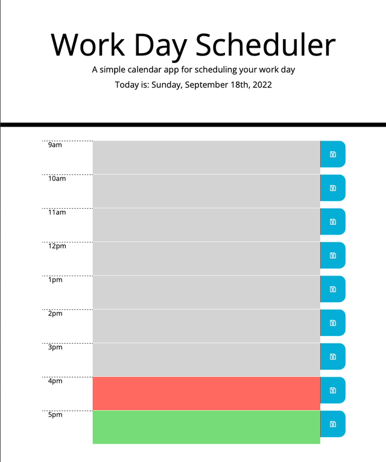

# Work Day Scheduler

## Description

This simple work day scheduler is designed to help you map out tasks in your day while showing you what tasks have past, are currently occuring, and are upcoming based on the time.  

This project also help me better understand how to integrate and work with thrid party APIs like jquery, moment and bootstrap to simplify code. 

## Installation

To review/work on this code on your machine, clone down the README.md, index.html, and assets folder (containing the script.js and style.css files) and open them in your code editor. 

Worth mentioning: 
- This application uses a few cdn's including: moment.js, jquery.js, bootstrap, and fontawesome. You can see which versions are being used in the index.html.
- The images folder in the assets folder is not needed for the code to run. It includes the demo gif below. 

## Usage

Once active the user will be able to map out any tasks/events for that day on an hourly basis (see demo below). 

Provide instructions and examples for use. Include screenshots as needed.

To add a screenshot, create an `assets/images` folder in your repository and upload your screenshot to it. Then, using the relative filepath, add it to your README using the following syntax:

For an example of the live application, follow this link: https://rdahltorp.github.io/work-day-scheduler/

## Features

Features included in this web app: 
- Dynamic date in the header that tells you today's date and day of the week. 
- Hour rows are color coded (gray for past, red for present, green for future) and update dynamically based on time. 
- User can enter in any of tasks/events in the middle coulmn of the hour rows and save them to local storage so they appear on page reload. 
